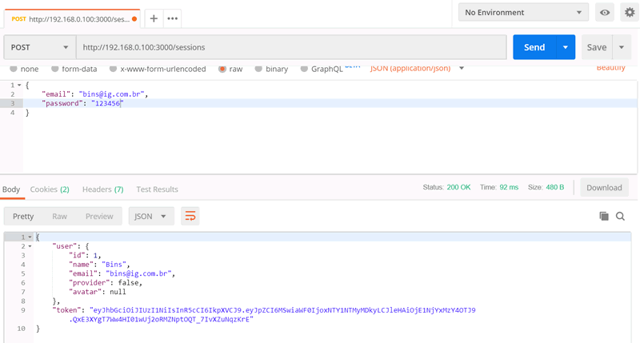
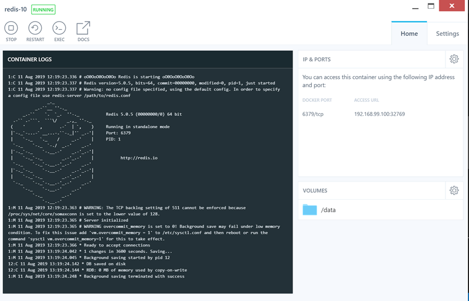
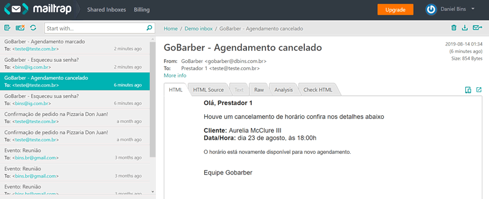

# GoBarber - Backend

Este é o backend feito em NodeJS + Express com banco de dados MySQL do aplicativo GoBarber.

Nesse desafio foi construída uma aplicação completa envolvendo back-end com NodeJS e mobile com React Native.

A aplicação consiste em um app de agendamento de serviços de uma barbearia. O aplicativo móvel será utilizado pelos clientes para agendar serviços.

O aplicativo pode ser visto neste link:

https://github.com/dbins/rocketseat_gobarber_mobile.git

## Requisitos Funcionais

**Usuário/Autenticação**

- Deve ser possível o usuário se autenticar e criar sua conta na aplicação;
- O usuário pode ser prestador de serviços ou cliente, você pode adicionar uma  coluna com o tipo de usuário na tabela de usuários. O prestador de serviços não pode utilizar o aplicativo;
- Quando um usuário se cadastra ele é automaticamente um cliente;

**Agendamento**

- O cliente não pode marcar uma data que já passou.
- O cliente não pode marcar um horário que já passou.
- O cliente não pode marcar numa data que seja no final de semana.
- O prestador de serviços deve receber um e-mail com o horário e os dados do cliente
- Na tela inicial do aplicativo, o cliente deve ver os agendamentos que ele marcou, e ter a opção de cancelar. Ao cancelar, o prestador de serviços deve receber um e-mail.

## Instalação

- git clone https://github.com/dbins/rocketseat_gobarber_api.git
- npm install
- Criar o banco de dados vazio no MySQL (nome: gobarber)
- Alterar as configurações de conexão com o banco de dados no arquivo .env localizado na raiz do projeto (# Database)
- 
- Crie as tabelas do banco de dados (migration): npm run migrate
- Para ativar o servidor: npm run start
- Ative o REDIS e configure as credenciais de envio de e-mail no arquivo .env localizado na raiz do projeto. (# Mail)
- O servidor vai subir no endereço http://192.168.0.100:3000. Isso pode ser alterado no arquivo .env localizado na raiz do projeto. (variável APP_URL)
- Para o envio de e-mails, além de iniciar o REDIS, será necessário, numa janela do terminal em separado, iniciar a fila, através do comando npm run queue.

## Redis

- No Windows 10, foi utilizado o Kitematic (Alpha) para gerenciar os containers
- Baixar o container Redis
- No arquivo .env localizado na raiz do projeto, configurar a seção (# Redis)
- No arquivo .env, localizado na raiz do projeto, colocar as credenciais de email na seção (# Mail)
- Iniciar o container Redis

  
  

## Rotas da aplicação

Para ver as rotas e o formato das requisições, consulte a documentação disponível no arquivo index.html localizado na raiz do projeto. Esta documentação foi criada usando a API Blueprint, o arquivo com a documentação se chama api.md e fica na raiz do projeto.

Um resumo das rotas pode ser visto abaixo:

| Rota                             | Método | Descrição                                                             |
| -------------------------------- | ------ | --------------------------------------------------------------------- |
| /users                           | POST   | Criar usuário                                                         |
| /users                           | PUT    | Atualizar usuário logado                                              |
| /sessions                        | POST   | Login do usuário - gerar Token                                        |
| /forgot_password                 | POST   | Envia o e-mail de esqueci minha senha                                 |
| /validate_token                  | POST   | Valida o token de esqueci minha senha, retornando os dados do usuário |
| /files                           | POST   | Salvar Imagem                                                         |
| /files/:id                       | GET    | Recuperar Imagem                                                      |
| /files/:id                       | PUT    | Atualizar Imagem                                                      |
| /files/:id                       | DELETE | Excluir Imagem                                                        |
| /providers                       | GET    | Lista os prestadores de serviços                                      |
| /providers/:providerId/available | GET    | Lista os horários disponíveis do prestador de serviço                 |
| /providers/:providerId/days      | GET    | Lista os dias disponíveis do prestador de serviço                     |
| /appointments                    | GET    | Listar os agendamentos marcados pelo cliente                          |
| /appointments                    | POST   | Grava um novo agendamento                                             |
| /appointments/:id                | DELETE | Cancela um agendamento                                                |
| /schedule                        | GET    | Lista os agendamentos do prestador de serviço                         |
| /notifications                   | GET    | Lista as notificações enviadas ao prestador de serviço                |
| /notifications/:id               | PUT    | Marca uma notificação como lida                                       |

## Documentação e testes

A documentação da API pode ser encontrada na raiz do projeto, ela está disponível nos formatos  BlueprintAPI e Swagger. Com base na documentação, foram feitos testes da API utilizando Dredd.
